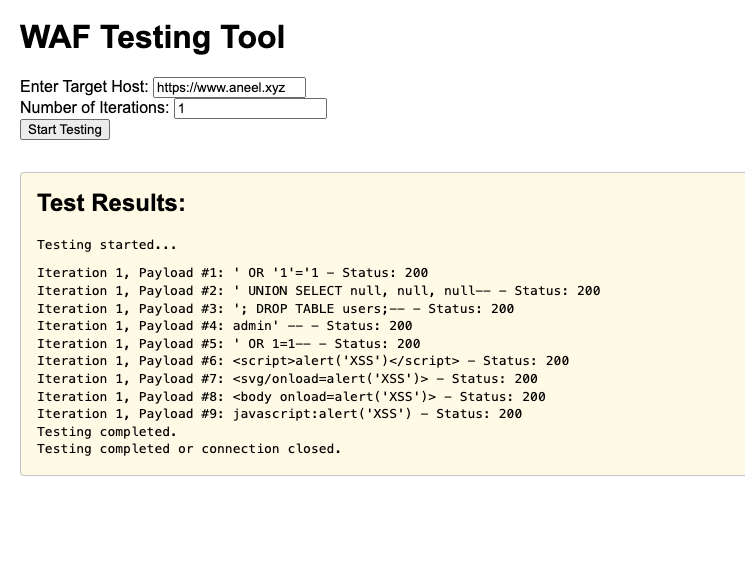

# WAF Testing Tool

A lightweight tool to test the efficacy of Web Application Firewalls (WAFs) by sending common SQL injection and XSS payloads to a specified target. Results are streamed in real-time to the browser, providing immediate feedback on test execution.



---

## Features
- Real-time streaming of test results in the browser.
- Customizable number of iterations for payload testing.
- Supports SQL injection and XSS payloads.
- Simple, user-friendly web interface.

---

## Requirements
- [Node.js](https://nodejs.org/) (version 14 or higher)

---

## Installation
1. Clone the repository:
   ```bash
   git clone https://github.com/your-username/waf-testing-tool.git
   cd waf-testing-tool
   ```

2. Install dependencies:
   ```bash
   npm install
   ```

---

## Usage
1. Start the server:
   ```bash
   node server.js
   ```

2. Open your browser and navigate to:
   ```
   http://localhost:3000
   ```

3. Enter the target host and the number of iterations, then click **Start Testing**.

4. Observe live test results in the "Test Results" section of the page.

---

## Project Structure
```
waf-testing/
├── server.js         # Main entry point
├── routes/           # Route definitions
│   ├── form.js       # HTML form rendering
│   ├── start.js      # WAF testing logic
├── utils/            # Utility functions
│   ├── payloads.js   # Payload definitions
│   ├── helpers.js    # Helper functions
├── package.json      # Project metadata and dependencies
├── README.md         # Project documentation
```

---

## Payloads
This tool uses a predefined set of payloads to test the target:
### SQL Injection
- `' OR '1'='1`
- `' UNION SELECT null, null, null--`
- `'; DROP TABLE users;--`
- `admin' --`
- `' OR 1=1--`

### XSS
- `<script>alert('XSS')</script>`
- `<svg/onload=alert('XSS')>`
- `<body onload=alert('XSS')>`
- `javascript:alert('XSS')`

---

## Customization
To add or modify payloads:
1. Open the `utils/payloads.js` file.
2. Add or update payloads in the `getPayloads` function.

---

## Contributing
1. Fork the repository.
2. Create a new branch:
   ```bash
   git checkout -b feature-name
   ```
3. Commit your changes:
   ```bash
   git commit -m "Add feature"
   ```
4. Push to your branch:
   ```bash
   git push origin feature-name
   ```
5. Open a pull request.

---

## License
This project is licensed under the [MIT License](LICENSE).